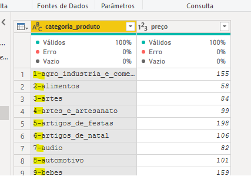
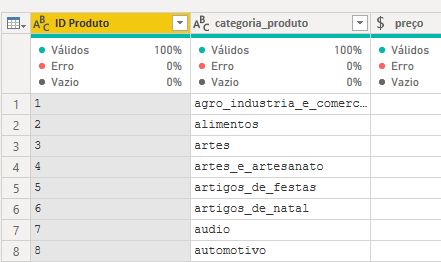
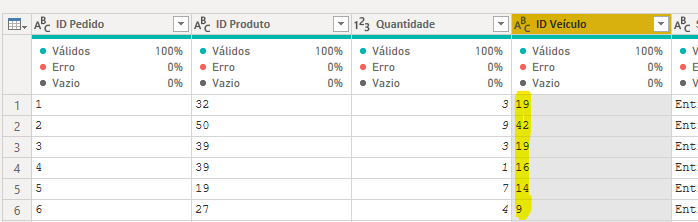
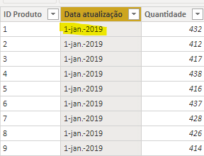
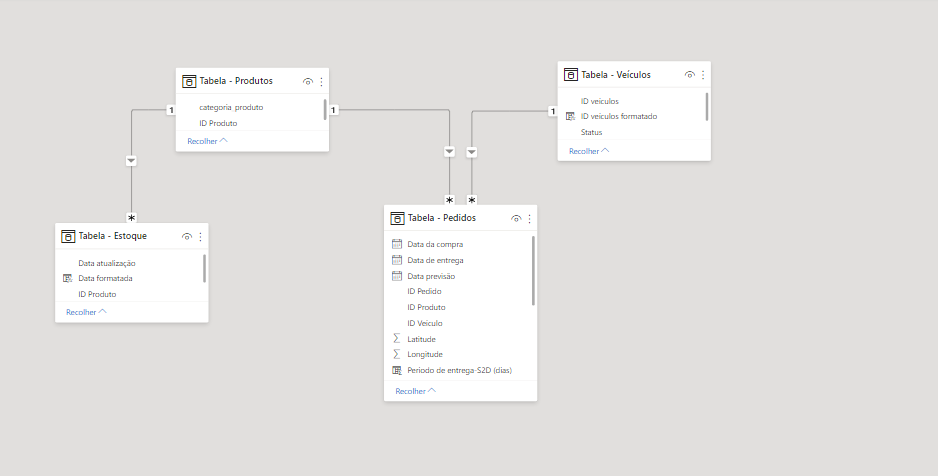
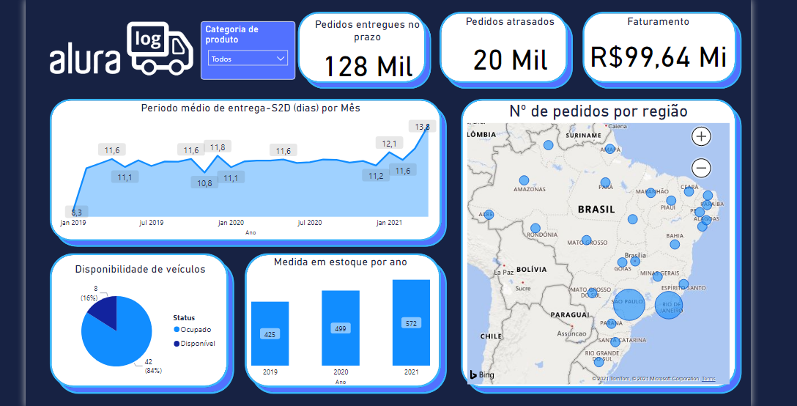

# Alura-Challenges-BI
Desafio de estimular o estudo e desenvolvimento dos alunos na plataforma do cursos online Alura, na área de Data Science, e também incentivar o uso de ferramentas de visualização de dados como Power BI.


## Primeira semana: Desafio Logístico

Na primeira semana deste projeto, recebemos um banco de dados de uma empresa de varejo. As tarefas iniciais eram trabalhar sobre os dados e formatá-los para que pudessem ser uilizados.

Este foi meu primeiro contato com ferramentas de **power BI**, então tive algumas dificuldades em trabalhar com o formato de data, convertendo-o de acordo com a localidade da minha máquina. Outro desafiofoi entender como manipular strings para extrair informações úteis das tabelas.

### Examplos:

* Separar a informação de uma coluna em duas:

    
    

* Alterar o formato de um identificador(ID) para que a ferramente pudesse reconhecer o relacionamento entre as tabelas:

    
    


### Tarefas para a confecção de um dash board:

Para confecção de um *dashboard*, que exibisse as informações pedidas pelo desafio, tive que adquirir uma base de conhecimento sobre a linguagem de manipulação de dados utilizada pela ferramenta power bi, a linguagem **DAX**.

* Visualizar quantas entregas foram feitas no prazo.

    ```
    pedidos_no_prazo = CALCULATE(
        COUNTROWS('Tabela - Pedidos'),
        FILTER(
            'Tabela - Pedidos', 
            'Tabela - Pedidos'[Data de entrega] <= 'Tabela - Pedidos'[Data previsão]
        )
    )
    ```

* Visualizar quantas entregas foram feitas atrasadas
    ```
    pedidos_atrasados = CALCULATE(
        COUNTROWS('Tabela - Pedidos'),
        FILTER(
            'Tabela - Pedidos', 
            'Tabela - Pedidos'[Data de entrega] > 'Tabela - Pedidos'[Data previsão]
        )
    )

    ```

* Calcular o S2D - Ship to door - expedição até a entrega, medido em dias.
    1. Encontrar a diferença, em dias, entra as datas de compra e entrega:
    ```
    Periodo de entrega-S2D (dias) = DATEDIFF(
         'Tabela - Pedidos'[Data da compra].[Date], 'Tabela - Pedidos'[Data de entrega].[Date], DAY
    )
    ```
    2.  Iterar sobre as linhas para calcular a média mensal:
    ```
    Periodo médio de entrega-S2D (dias) = AVERAGEX(
        'Tabela - Pedidos', 
        'Tabela - Pedidos'[Periodo de entrega-S2D (dias)
    )  
    ```

* Mostrar o número de veículos disponíveis:
    ```
    veiculos_disponiveis = CALCULATE(
        COUNTROWS('Tabela - Veículos'),
        'Tabela - Veículos'[Status] = "Disponível"
    )
    ```

* Visualizar o nível médio de estoque por ano:
    1. O formato original da data não permitia que fosse utilizada nos métodos DAX.
        
        

    2. Tive que antes converter para o tipo de **datetime**:
        ```
        Data formatada = DATEVALUE(
            SUBSTITUTE(
            SUBSTITUTE([Data atualização], ".", ""),
                "-", "/"
            )
        )
        ```
    3. 
        ```
        Media em estoque por ano = AVERAGEX('Tabela - Estoque', [Quantidade])  
        ```


Além do que foi pedido também acreditei que seria interessante fornecer a visualização do faturamento obtido pelos pedidos realizados. Pela tabela de pedidos foi possível implementar o seguinte:

```
Valor = LOOKUPVALUE(
    'Tabela - Produtos'[preço],
    'Tabela - Produtos'[ID Produto],
    [ID Produto]
)*[Quantidade] 
```

E, graças às manipulações feitas sobre as colunas, a plataforma conseguiu reconhecer o relacionamento correto entra as bases de dados. O que permitiu a realização de uma filtragrem dinâmica sobre o dashboard final, a partir das diferentes categorias de produtos.





## Resultado final



