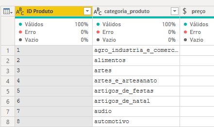
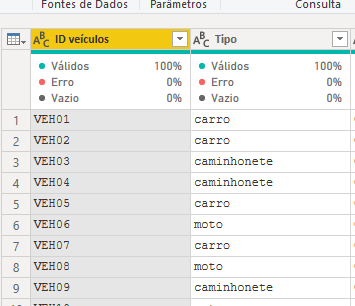
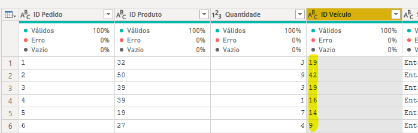
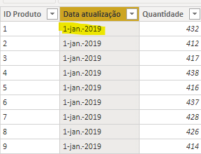
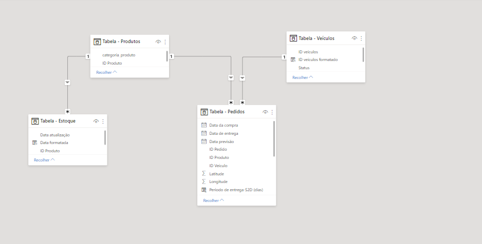
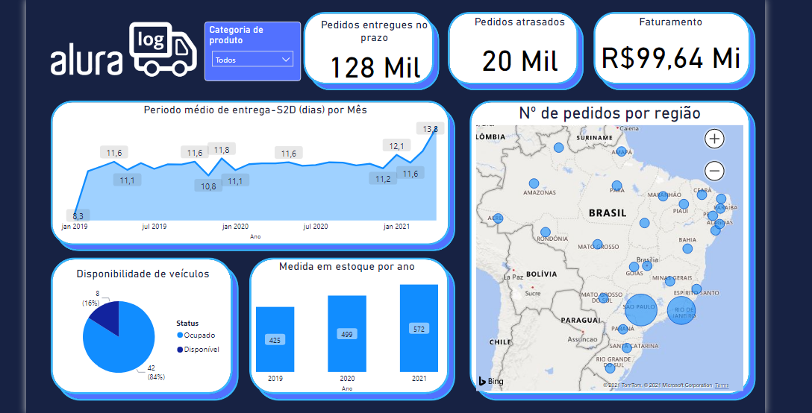
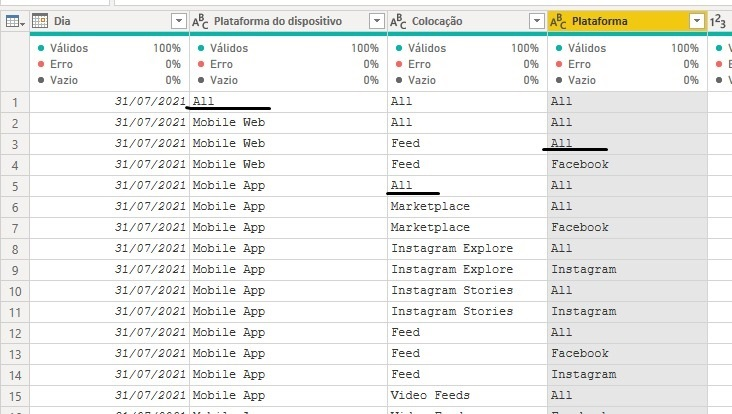
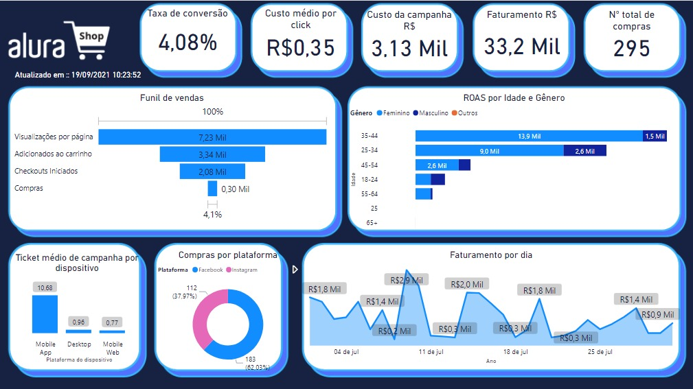
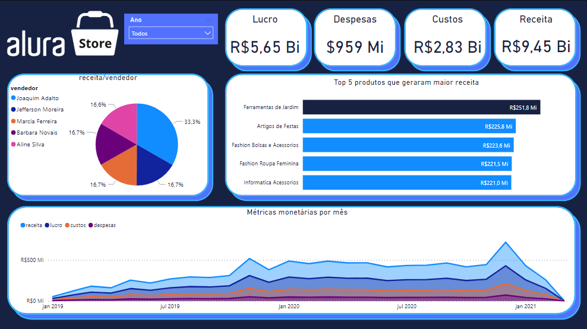

# Alura-Challenges-BI
Desafio para estimular o estudo e desenvolvimento dos alunos da plataforma do cursos online Alura, na área de Data Science, e também incentivar o uso de ferramentas de visualização de dados como Power BI.


## Primeira semana: Desafio Logístico

Na primeira semana deste projeto, recebemos um banco de dados de uma empresa de varejo. As tarefas iniciais foram trabalhar sobre os dados e formatá-los para que eles pudessem ser utilizados.

Este foi meu primeiro contato com ferramentas de **power BI**, então tive algumas dificuldades em trabalhar com o formato de data, convertendo-o de acordo com a localidade da minha máquina. Outro desafio foi entender como manipular strings para extrair informações úteis das tabelas.

### Exemplos:

* Separar a informação de uma coluna em duas:

    
    

* Alterar o formato de um identificador(ID) para que a ferramenta pudesse reconhecer o relacionamento entre as tabelas:

    
    


### Tarefas para a confecção do dash board:

Para confecção de um *dashboard*, que exibisse as informações pedidas pelo desafio, tive que adquirir uma base de conhecimento sobre a linguagem de manipulação de dados utilizada pela ferramenta power bi, a linguagem **DAX**.

* Visualizar quantas entregas foram feitas no prazo.

    ```
    pedidos_no_prazo = CALCULATE(
        COUNTROWS('Tabela - Pedidos'),
        FILTER(
            'Tabela - Pedidos', 
            'Tabela - Pedidos'[Data de entrega] <= 'Tabela - Pedidos'[Data previsão]
        )
    )
    ```

* Visualizar quantas entregas foram feitas atrasadas
    ```
    pedidos_atrasados = CALCULATE(
        COUNTROWS('Tabela - Pedidos'),
        FILTER(
            'Tabela - Pedidos', 
            'Tabela - Pedidos'[Data de entrega] > 'Tabela - Pedidos'[Data previsão]
        )
    )

    ```

* Calcular o S2D - Ship to door - expedição até a entrega, medido em dias.
    1. Encontrar a diferença, em dias, entre as datas de compra e entrega:
    ```
    Periodo de entrega-S2D (dias) = DATEDIFF(
         'Tabela - Pedidos'[Data da compra].[Date], 'Tabela - Pedidos'[Data de entrega].[Date], DAY
    )
    ```
    2.  Iterar sobre as linhas para calcular a média mensal:
    ```
    Periodo médio de entrega-S2D (dias) = AVERAGEX(
        'Tabela - Pedidos', 
        'Tabela - Pedidos'[Periodo de entrega-S2D (dias)
    )  
    ```

* Mostrar o número de veículos disponíveis:
    ```
    veiculos_disponiveis = CALCULATE(
        COUNTROWS('Tabela - Veículos'),
        'Tabela - Veículos'[Status] = "Disponível"
    )
    ```

* Visualizar o nível médio de estoque por ano:
    1. O formato original da data não permitia que fosse utilizada nos métodos DAX.
        
        

    2. Tive antes que converter para o tipo de **datetime**:
        ```
        Data formatada = DATEVALUE(
            SUBSTITUTE(
            SUBSTITUTE([Data atualização], ".", ""),
                "-", "/"
            )
        )
        ```
    3. 
        ```
        Media em estoque por ano = AVERAGEX('Tabela - Estoque', [Quantidade])  
        ```


Além do que foi pedido também acreditei que seria interessante fornecer a visualização do faturamento obtido pelos pedidos realizados. Pela tabela de pedidos foi possível implementar o seguinte:

```
Valor = LOOKUPVALUE(
    'Tabela - Produtos'[preço],
    'Tabela - Produtos'[ID Produto],
    [ID Produto]
)*[Quantidade] 
```

E, graças às manipulações feitas sobre as colunas, a plataforma conseguiu reconhecer o relacionamento correto entra as bases de dados. O que permitiu a realização de uma filtragrem dinâmica sobre o dashboard final, a partir das diferentes categorias de produtos.





### Resultado final



## Segunda semana: Desafio Marketing

Dessa vez o contexto do desafio foi a análise de dados oriundos de uma plataforma de _e-commerce_. Os dados vieram formatados em arquivos **JSON**, tipicamente utilizados em aplicações web, apresentando as informações das interações dos usuários.

A primeira tabela apresentava dados a respeito dos dispositivos e plataforma utilziadas pelos usuários no momento da compra, enquanto a segunda, forneca informações a respeito do perfil desses usuários (idade e gêreno).

Através das duas bases foi possível retirar insights úteis para a tomada de decisões sobre a gestão da campanha de anúncios, como o perfil do cliente atingido, o ticket médio de cada plataforma e o retorno do investimento nas campanhas (ROAS).


Neste desafio, algo sútil a ser percebido nas bases, foi a redundância da informação armazenada. Tinhamos a mesma informação sendo contabilizada mais de uma vez em colunas diferentes:



Como os dados possuiam uma hierarquia:

Plataforma do dispositivo > Colocação > Plataforma

Bastou filtrar o valor 'All' da coluna de menor hierarquia e a mudança foi propagada às outras.

### Tarefas para a confecção do dash board:

* Vamos calcular o valor convertido em compras por dias, e também mostrar no dashboard.

* Vamos calcular o total de valor investido que foi convertido em compras dentro do e-commerce. Vamos também visualizar essa métrica no dashboard.

* Vamos calcular o total de compras feitas durante a campanha e visualizar no dashboard.

* Vamos calcular e escolher um visual para mostrar o total investido na campanha de marketing.

Para as tasks acima, tendo a base previamente organizada (filtrando-se as redundâncias) bastou realizar a soma dos valores das colunas correspondentes a cada métrica.


* Vamos calcular o custo por click, ou seja, quanto foi investido para gerar 1 clique dentro do e-commerce. Vamos também visualizar essa métrica.

    ```
    Valor médio por click = Custo total da campanha/Número de clicks
    ```

* Vamos calcular e escolher um visual para mostrar o total investido na campanha de marketing.

* Vamos calcular, baseado nos dados disponibilizados, o ticket médio por dispositivo. Vamos mostrar no dashboard essa métrica.

* Exibir a jornada de compra desde a visualização da página até a compra realizada. Aqui vamos utilizar a criatividade para exibir no dashboard de forma bem interessante, apresentando a taxa de conversão.
    Para essa métrica achei interessante apresentar os dados como uma pirâmide invertida, onde é possível visualizar a proporção de _leads_ que atravessam cada etapa.

* Através dos dados disponibilizados vamos calcular o ROAS, o retorno do investimento em publicidade por idade e gênero, Vamos mostrar essa métrica no dashboard.

    ```
        ROAS = (Faturamento - Custo) / Custo
    ```

### Observações

O que achei interessante deste desafio foi entender que as duas tabelas forneciam basicamente a mesma informação, mas sobre **óticas diferentes**. Ou seja, dependento da visualização que desejamos apresentar, há ocasiões em que pode fazer mais sentido utilizar os dados da tabela de clientes e casos em que fará mais sentido utilizar os dados da tabela de dispostivos.

Exemplo:

Se quero aprensentar extratificando pelo perfil do cliente, uso a tabela de usuários. Caso meu objetivo principal seja entender a origem dos clicks por plataforma, utilizo a tabela por dispositivos.


### Resultado final



## Terceira e última semana : Desafio financeiro

Na última semana do desafio de BI da alura tivemos acesso à uma base de dados, da qual se exigiu dos alunos um conhecimento básico sobre **SQL** para que conseguissem utilizá-la adequadamente.

Dessa vez o contexto do exercício era o de uma loja de vendas que possuia diversas tabelas relacionadas entre si. Deveríamos apresentar insights sobre o estado atual do processo de vendas e construir variações de cenários para futuro de acordo com as métricas que considerássemos relevantes.

### Tarefas para a confecção do dashboard

* Calcular a receita
    Neste tópico, pude enxergar que não havia muita constância na formatação dos dados associados aos valores de vendas na tabela de notas fiscais. Porém a informação do frete permanecia constante como 10% do valor da transação e, através dela foi possível se calcular o valor original.

* Exibir custos
    Como as tabelas estavam todas relacionadas pelo _id do produto_ ou pelo _id do pedido_, foi possível calcular métricas de valores cruzando colunas através da funções como RELATED, que permitiu obter dados de tabelas conectadas e SUMX, que fornecia mais flexibilidade para o cálculo.

* Calcular depesas
    Para o cálculo foi considerado como despesas : frete + impostos.

* Calcular o lucro
    Lucro = receita - custos - despesas

* Analisar e exibir mensalmente as métricas
    Para poder demonstrar esse comportamento de maneira mais adequada, escolhi a exibição por meio de um gráfico de áreas sobrepostas.

* Análise de cenários
    Criei uma segunda página onde forneci ao usuário a possibilidade de variar métricas como impostos, valor de custo, frete e receita para poder avaliar qual seria o peso de cada parâmetro no resultado do processo.

### Obesarvações
Também acreditei que seria interessante poder visualizar a contribuição individual de cada vendedor ao resultado final e o peso dos cinco produtos mais vendidos, apresentei aquele como um gráfico pizza que exibia essa informação por meio de porcentagens e este por meio de um gráfico de barras horizontais.

### Resultado final



